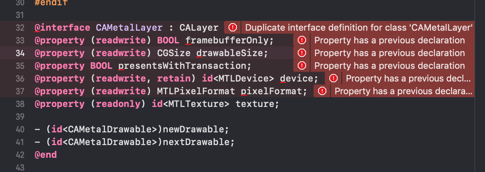
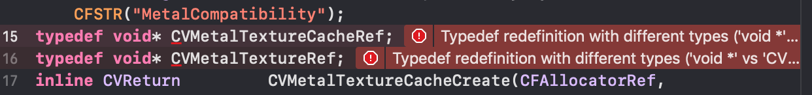
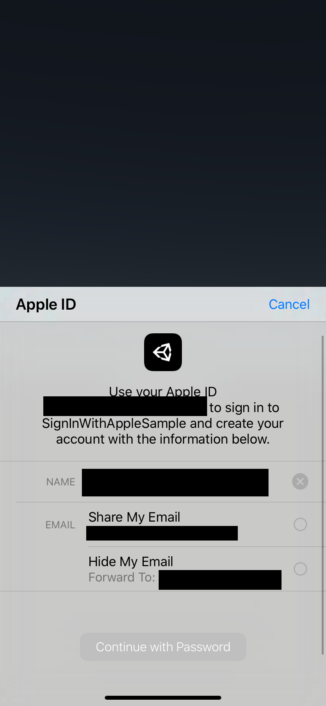

# [WIP] SignInWithAppleSample

## Environment
- 2018.4.0f1
- Xcode 11.0 beta (11M336w)

## 参考
- [Adding the Sign In with Apple Flow to Your App
](https://developer.apple.com/documentation/authenticationservices/adding_the_sign_in_with_apple_flow_to_your_app)
- [Human Interface Guidelines SignInWithApple](https://developer.apple.com/design/human-interface-guidelines/sign-in-with-apple/overview/)

## 現状
Xcodeでシミュレータビルドする際にMetal周りでエラーが出る

該当する箇所を消せばビルドは可能

Signinを押すことで処理が走る

ここでパスワードを入力するのだが処理が完了せずコールバックも走らない

またボタンは公式で用意されているものに準拠しないといけないためUnityだと扱い辛いそう(今回は処理のSampleのみの予定)
[ASAuthorizationAppleIDButton](https://developer.apple.com/documentation/authenticationservices/asauthorizationappleidbutton)